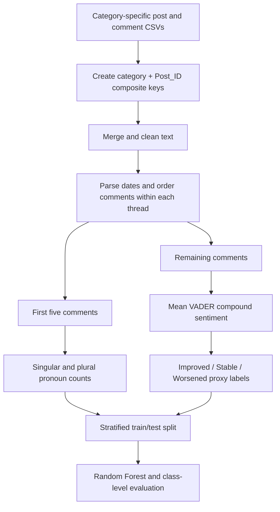

# Mental Health Recovery Trajectories — Part A

**Exploratory data engineering, sentiment-based labels and a first machine-learning baseline using longitudinal Beyond Blue forum data.**

This project investigates whether language in the first five comments of a discussion thread can predict a sentiment-based label derived from its later comments. Part A builds the initial pipeline: combine category-specific datasets, investigate identifier collisions, reconstruct thread interactions, create linguistic features and evaluate a Random Forest classifier.

The main contribution is a working exploratory pipeline and a baseline that exposes the need for better targets and evaluation. The labels `Improved`, `Stable` and `Worsened` are automated sentiment proxies; they are not verified measures of a person's recovery.

[Explore the Part A notebook](Mental_Health_Trajectories_Part_A.ipynb) · [Read the wider research case study](https://www.hariprasad.world/mental-health-research)

## At a glance

| Item | Part A implementation |
| --- | --- |
| Source | Beyond Blue forum post and comment CSV files |
| Recorded input | 4,735 post rows and 306,334 comment rows across nine file-derived categories |
| Modelling dataset | 4,698 threads with both an early and a later comment slice |
| Early features | Two raw counts: first-person singular and plural pronouns |
| Target | Mean VADER compound sentiment of comments after the first five |
| Model | Random Forest, 100 trees, balanced class weights |
| Evaluation | Stratified 80/20 thread split; `random_state=42` |
| Recorded outcome | 78.8% accuracy; macro F1 of 0.31; poor minority-class performance |

These figures come from the notebook's saved outputs. They describe Part A and should not be substituted for the later Part B dataset or results.

## What I built

- **Multi-file ingestion:** load category-specific post and comment files and retain their source category.
- **Identifier investigation:** examine reused post IDs, duplicate records and timestamp parsing problems before using category-aware composite keys for the final merge.
- **Exploratory analysis:** visualise thread lengths, category activity and post/comment word counts.
- **A temporal feature/target split:** use the first five comments for features and subsequent comments for an outcome proxy.
- **An interpretable baseline:** train a Random Forest on two linguistic features and inspect class-level metrics and feature importance.

## Pipeline



### 1. Ingest and join the data

The notebook reads `*_post.csv` and `*_comment.csv` files. In its final ingestion block, it derives `Forum_Category` from each filename and creates:

```python
Composite_ID = Forum_Category + "_" + Post_ID.astype(str)
```

Comments are joined to posts using this key. This addresses the ambiguity of using a bare `Post_ID` across category files. The final block records 306,334 merged interaction rows and exports `BeyondBlue_Master_Preprocessed.csv`.

Earlier cells explore exact-row deduplication, UUID-based thread identifiers and nearest-preceding-post matching. These are exploratory alternatives: the final ingestion block reloads the source files and uses the composite-key merge instead.

### 2. Clean and order the interactions

Text cleaning removes HTML tags, replaces line breaks and collapses whitespace. Comment date/time strings are stripped of non-ASCII characters, parsed with `dayfirst=True` and sorted within each `Composite_ID`.

Comments are ranked within each thread. The first five form the **early slice**, and comments ranked above five form the **later slice**. The modelling dataset retains only threads with both slices, producing 4,698 threads in the saved run.

### 3. Construct the target

NLTK's VADER analyser scores each later comment. The mean compound score for the thread is converted to a label:

| Mean later-comment sentiment | Label used in the notebook |
| --- | --- |
| Greater than `0.05` | `Improved` |
| From `-0.05` to `0.05`, inclusive | `Stable` |
| Less than `-0.05` | `Worsened` |

This is a measure of **later sentiment level**, not a measured change from an earlier baseline. It combines comments from all contributors rather than tracking only the original poster.

### 4. Extract features and train the baseline

The early comments are concatenated and converted to two numeric features:

- `Singular_Pronouns`: occurrences of `i`, `me`, `my`, `mine` and `myself`.
- `Plural_Pronouns`: occurrences of `we`, `us`, `our`, `ours` and `ourselves`.

These are raw counts, without word-count normalisation. The original post text and the concatenated comment text are not model inputs. Part A does not use TF-IDF, embeddings or a neural language model.

```python
X_train, X_test, y_train, y_test = train_test_split(
    X, y, test_size=0.2, random_state=42, stratify=y
)

rf_model = RandomForestClassifier(
    n_estimators=100,
    random_state=42,
    class_weight="balanced"
)
```

## Results and interpretation

The saved run uses **3,758 training threads** and **940 test threads**.

| Class | Precision | Recall | F1 | Test support |
| --- | ---: | ---: | ---: | ---: |
| Improved | 0.92 | 0.85 | 0.88 | 865 |
| Stable | 0.02 | 0.03 | 0.02 | 29 |
| Worsened | 0.01 | 0.02 | 0.02 | 46 |
| Macro average | 0.32 | 0.30 | 0.31 | 940 |
| Weighted average | 0.84 | 0.79 | 0.82 | 940 |

**Overall accuracy: 78.8%.** The class report is rounded to two decimal places in the notebook.

The test set is heavily imbalanced: 865 of 940 threads are labelled `Improved`. Always predicting that class would achieve **92.0% accuracy**, calculated from the saved class supports. That comparison is not a separately trained baseline in the notebook, but it shows why accuracy alone is misleading here.

The Random Forest does not outperform this majority-class accuracy reference and identifies very few `Stable` or `Worsened` threads. Part A therefore establishes a starting point for improving feature representation and checking whether sentiment-derived labels capture the intended research question. It does not demonstrate reliable recovery prediction or an operational triage system.

## Repository contents

```text
Mental-Health-Research-Project/
├── Mental_Health_Trajectories_Part_A.ipynb
├── README.md
└── LICENSE
```

The repository does not include `dataset.zip`, the source CSVs, a fitted model or a pinned dependency file. Saved notebook outputs can be inspected without those files; recomputing the analysis requires the corresponding source data. (The dataset is proprietary and cannot be shared)

## Running the analysis

### Environment

The notebook records a Python **3.13.3** kernel. Package versions were not recorded, so the following commands are a starting environment derived from the imports, not a verified version lock.

```bash
git clone https://github.com/hari047/Mental-Health-Research-Project.git
cd Mental-Health-Research-Project
python -m venv .venv
```

Activate the environment:

```powershell
# Windows PowerShell
.\.venv\Scripts\Activate.ps1
```

```bash
# macOS / Linux
source .venv/bin/activate
```

Install the imported packages and open the notebook:

```bash
python -m pip install jupyterlab pandas numpy matplotlib seaborn nltk scikit-learn
jupyter lab Mental_Health_Trajectories_Part_A.ipynb
```

The VADER cell downloads `vader_lexicon` through NLTK if necessary, which requires network access.

### Data requirements

Place the authorised source CSVs beside the notebook, using matching category names such as `anxiety_post.csv` and `anxiety_comment.csv`. Alternatively, provide `dataset.zip` and run the extraction cell; it flattens CSV paths into the working directory and can overwrite files with the same basename.

The final pipeline reads these fields:

| File type | Required columns |
| --- | --- |
| Posts | `Post_ID`, `Post_Content`, `Post_Author`, `Post_Date`, `Post_Time` |
| Comments | `Post_ID`, `Comment_Content`, `Comment_Date`, `Comment_Time` |

Earlier exploratory cells also access fields including `Post_Author_Rank`, `Post_Category`, `Number_of_Comments`, `Comment_ID` and `Comment_Author`.

### Focused execution path

The notebook preserves development experiments and is not yet a clean **Restart Kernel → Run All** workflow. An early reassignment of `posts_df` removes category/composite-key columns needed by later exploratory cells.

To follow the final baseline from a fresh kernel, execute these blocks in order:

1. **Importing the libraries** — code beginning `# Importing all the necessary libraries`.
2. **Extracting the dataset** — only if using `dataset.zip`.
3. **Merging the Datasets** — code beginning `# INGEST & TAG POSTS`.
4. **Implementing VADER** — create the early features and later labels.
5. **Implement the Random Forest Classifier Model** — fit and evaluate the classifier.

These correspond to cells **4, 7, 53, 56 and 58**, counting all cells from one in the documented notebook revision. The comments-per-category plot immediately after the merge is optional. This path follows the code dependencies; the reported results above are retained notebook outputs, not a new execution performed for this README.

## Limitations and next steps

- **Target validity:** positive forum sentiment is not evidence of clinical recovery. Supportive replies can dominate the later-comment average, and Part A contains no human validation of these labels.
- **Limited representation:** two pronoun counts capture a narrow part of language and depend on comment length. The baseline needs comparison with richer features and an explicit dummy classifier.
- **Data integrity:** the final reload does not retain the earlier exact-row deduplication. Composite-key uniqueness, merge cardinality, duplicate interactions and failed timestamps need explicit checks before treating the pipeline as reproducible.
- **Evaluation scope:** one random thread-level split is used. There is no author-grouped split, time-based holdout, cross-validation or hyperparameter search; authors may appear in multiple threads across the split.
- **Reproducibility and data handling:** dependencies are unpinned and exploratory outputs include sample records. Review and redact identifying fields and forum text before sharing derived data or refreshed notebook outputs. The preprocessing export retains source fields and is not an anonymised dataset.

**Part B:** the later research extends this initial baseline, but its implementation is not included in this repository. A public Part B showcase is planned separately. The portfolio case study describes the wider project; its later validation findings should not be read as Part A results.

## Author and licence

**Hari Prasad Rangaraj**

Supervised by **Dr Menasha Thilakaratne**, as credited in the notebook.

The repository code is available under the [MIT License](LICENSE). This does not establish redistribution rights for the underlying forum data.

This repository was made as a public showcase of an Adelaide University Research Project and must not be copied or redistributed. 

*README prepared from notebook revision [`0cdc9ef`](https://github.com/hari047/Mental-Health-Research-Project/blob/0cdc9ef7bf6c7a14990a8ee98b9418c2cf8d6a79/Mental_Health_Trajectories_Part_A.ipynb).*
